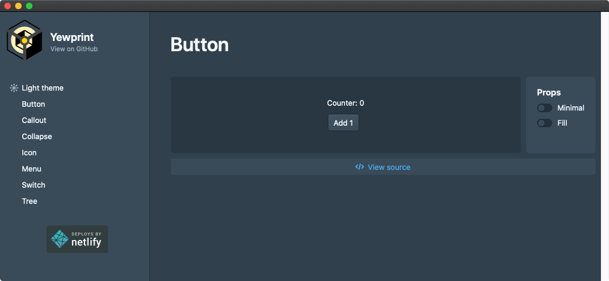

# Tauri Yewprint desktop app

Example how to combine [Tauri toolkit](https://tauri.studio/), [Yew](https://github.com/yewstack/yew) and [Yewprint](https://github.com/cecton/yewprint)  into small desktop application with clean UI.

Size of application without additional optimization (Mac): 4.7MB 

| Tested on  | Mac  | Win | Lin |
|---|---|---|---
| Tauri   | ✅ | ❌ | ❌ |

Application is using:

- [Tauri toolkit](https://tauri.studio/) that helps developers make applications for the major desktop platforms.
- [Yewprint](https://github.com/cecton/yewprint) port of [Blueprint.js](https://blueprintjs.com), but for
[Yew](https://github.com/yewstack/yew) in [Rust](https://www.rust-lang.org/).

- macOS requirements: `brew install yarn`

## How to run

- `make` -> see Makefile for details

## Requirements

Requirements for [Yew](https://github.com/yewstack/yew) and [Tauri toolkit](https://tauri.studio/)

### Mac

- `brew install yarn`
